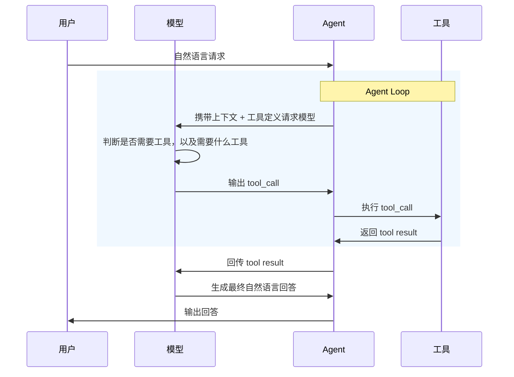

# 准备工作的提示词：

```text
请帮我在当前目录创建一个 Node.js + TypeScript CLI 项目。

要求：
1. 使用 npm 管理脚本。
2. 用 .env 配置 AI_API_KEY、AI_BASE_URL、AI_MODEL。
3. 实现 src/providers/openaiCompatible.ts，用 fetch 调用 OpenAI-compatible chat completions API。
4. 实现 src/agent.ts，保存 messages，并提供 sendMessage(input)。
5. 实现 src/cli.ts，用 readline 循环读取用户输入，输入 exit 退出。
6. package.json 里添加 chat 和 typecheck 脚本。
7. 最后运行 npm run typecheck，并告诉我如何运行 npm run chat。
```

.env是模型配置文件，自己填好，AI一般不会上传这个到GitHub，以防万一看一眼。

在ai-agent-cli文件夹里，启动终端，npm run chat就可以打开应用。

## 对话AI和做事AI的步骤不一样

以一个简单的问题为例（不需要循环，不需要复杂数据流）

对话AI的工作流程是

```text
用户自然语言
↓
模型处理
↓
输出给用户
```

最简单的有Tool Use的AI Agent工作流程是



依据以上的数据流，步骤就是这样：

1. 会用一个 LLM API 完成普通对话。（配好.env就可以了）
2. 会让模型输出结构化 JSON。
3. 会定义一个工具函数，例如 search、calculator、read_file、命令行。
4. 会解析模型的 tool call / function call。
5. 会执行工具，并把工具结果喂回模型。
6. 会给 agent loop 加最大步数、超时和错误处理。

第一步解决自然语言输入和输出。

JSON是最常见的，大模型和工具之间的通信格式。

是大模型决定要用什么工具，Agent只是听命令然后传令给工具层。

工具定义请求模型，它会把所有工具的名字都发回大模型。


**Q：为什么不接入Chatgpt？**

A：不同大模型有不同的接入协议，首先用DeepSeek模型，暂时不开发御三家的接口协议。

**Q：为什么不直接写代码而是Vibe Coding？**

A：学习AI Agent流程，不是学写代码。

**Q：如果有多个工具调用步骤呢？**

A：用Agent Loop解决，如果返回的tool result被Agent判断为不合格，会处理后，再发给大模型做修改或完善，而不是让它生成自然语言。

```text
Agent → 模型 → 工具 → Agent → 模型 → 工具 → ...
```
